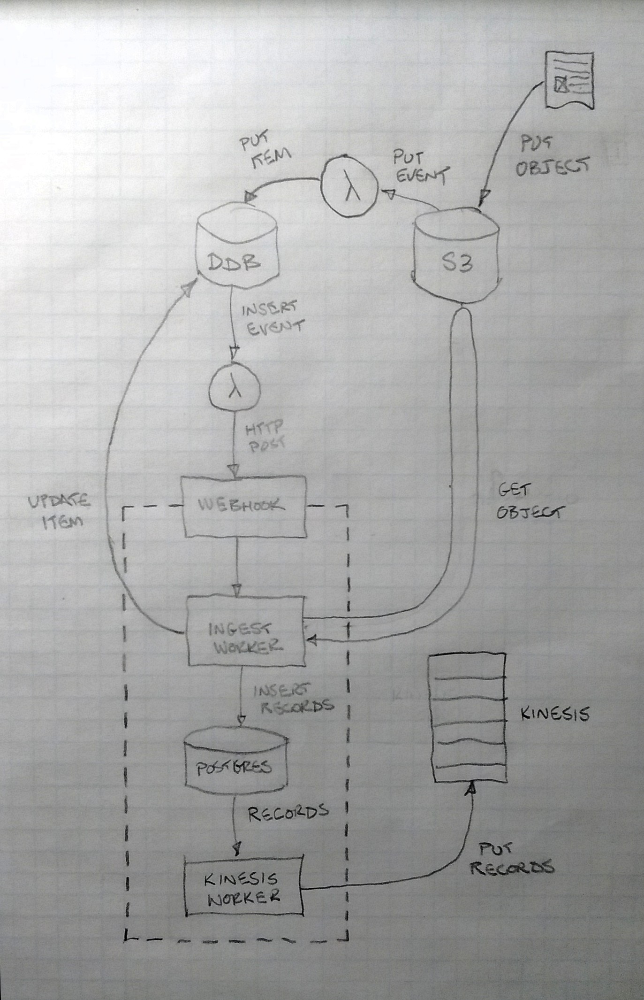

# kinesis-adapter

Exposes a webhook that receieves notifications of new log files in S3. The
service downloads the file and puts all of the records on a Kinesis stream.

## Overview

This service comprises three main components: a **web server** to receive
webhook requests from a Lambda fired by the log bucket's DynamoDB stream, an
**ingest worker** to download log files from S3 and insert them into the local
Postgres DB, and a **kinesis worker** to take records from the database and
write them to the appropriate Kinesis streams.

<p align="center">
  <kbd>
    
    <br>
    Architecture diagram.
  </kbd>
</p>

Every effort is made to achieve as close to **exactly once delivery** of log
records to Kinesis as possible, as double-counting or losing records will
result in **instant counts drift**. But Kinesis does not provide any type of
transactional put interface, so 100% correctness is simply not possible without
accepting the complexity of checkpointing the stream before a write and reading
the stream from that checkpoint after a Kinesis write timeout to determine
whether the records were successfully written or not. Instead, a robust **at
least once** delivery is implemented with a very low probability of duplication.

## Webserver

The service accepts new S3 file notifications via a webhook endpoint. **This
endpoint is not secure** &mdash; it must be protected by VPC and security group
firewall rules.

```bash
# healthcheck always responds with 200 OK
curl localhost/_health
```

```bash
# are there records enqueued, files ingesting, or are we down for maintenance?
curl localhost/status
```

```bash
# webhook downloads a file from S3 and ingests it
curl -H content-type:application/json -d '{"table": "...", "s3path": "..."}' localhost/ingest
```

```bash
# shutdown workers and webserver gracefully (only used by the upstart job)
curl -d '' localhost/shutdown
```

## Ops

Starting, stopping, and restarting the kinesis adapter service (it should
shut down gracefully via upstart or `SIGTERM`):

```bash
# start the service
start kinesis-adapter
```

```bash
# stop the service
stop kinesis-adapter
```

```bash
# restart the service
restart kinesis-adapter
```

Maintenence mode pauses the ingestion of new log files while continuing to
process records already ingested. The webhook endpoint will return status
`500 SERVER UNAVAILABLE` while in maintenance mode:

```bash
# take webhook down for maintenance
touch /down-for-maintenenace
```

```bash
# return webook to normal operation
rm -f /down-for-maintenenace
```

The service auto-scaling group is configured with a lifecycle hook to delay
termination of instances until they have processed all of the records in the
database. A cron job on the instance runs at one minute intervals to monitor the
instance's lifecycle state, and when the instance enters the `Terminating:Wait`
state it enters maintenance mode, stops ingesting new files, and records
heartbeat events until all ingested records have been processed successfully.

```bash
# force send lifecycle CONTINUE action on instance in Terminating:Wait state
/opt/kinesis-adapter/bin/asg-lifecycle -f
```

> **NOTE:** Do not terminate an instance with records waiting to be processed
> or files being ingested &mdash; **data will be lost**.

## Logs

Logs are written to syslog.

## Metrics

Metrics are sent to DataDog.

## Deploy

You'll need:

* Docker

This service is deployed according to the teamengines deployment system:

* Build the jar.
* Package the project locally.
* Deploy the package to a running instance.
* Create a new AMI from that instance.
* Update CloudFormation template with new AMI ID.
* Deploy CloudFormation stack.

The scripts in the `./ami` directory are hooks used by the Adzerk deployment
system; they can be modified to suit your infrastructure and devops procedures.

## Hack

You'll need:

* Docker
* Java 1.8+ JRE
* [boot][1]

```bash
# start local postgres in docker
./run-db
```

```bash
# connect to db
psql -h localhost -U postgres
```

```bash
# create/reload schema
cat schema.sql |psql -h localhost -U postgres
```

```bash
# setup environment variables
. ./config/qa.sh
```

```bash
# start a clojure repl
boot repl
```

[1]: https://github.com/boot-clj/boot
